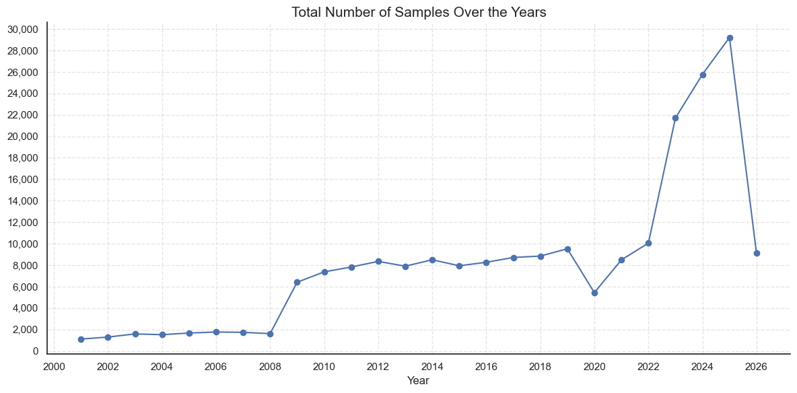
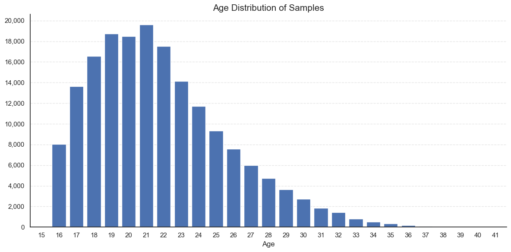
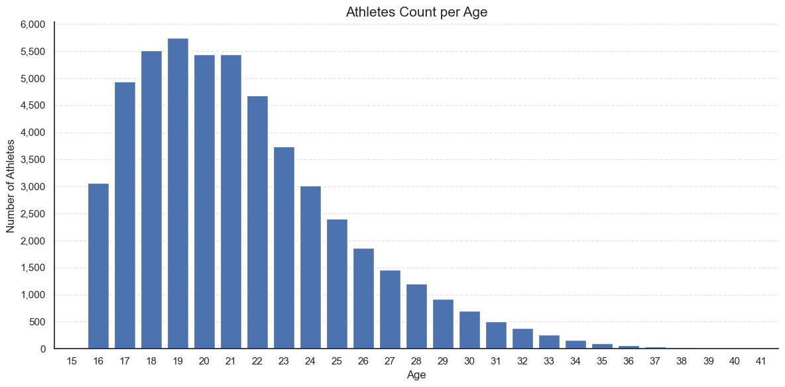
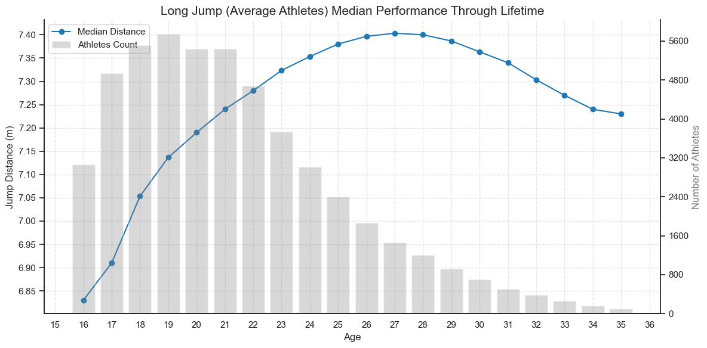
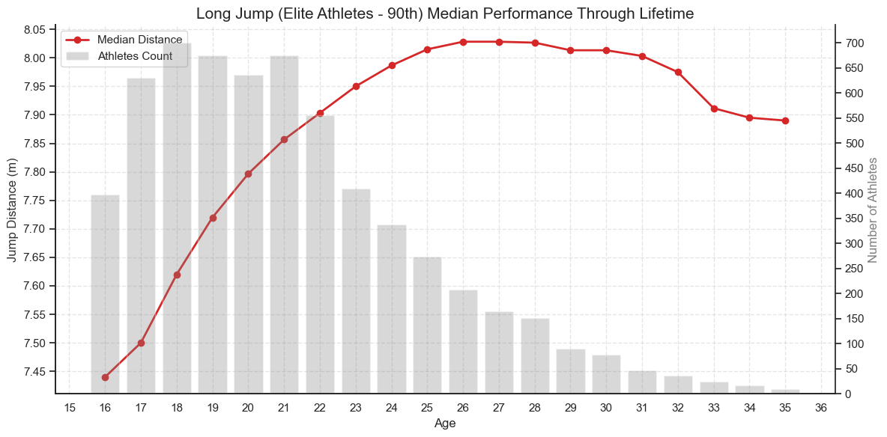
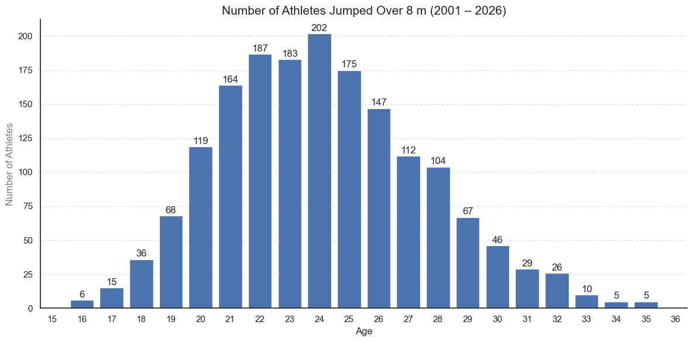

# Long Jump Performance Analytics: Age & Evolution


## Project Overview
This study analyzes the evolution of athletic performance in the Men's Long Jump, focusing specifically on how age impacts performance. By processing over 200,000 records from World Athletics, the analysis identifies the "peak performance window" for elite athletes and contrasts their development trajectory against the general athletic population.

The goal is to provide data-driven insights into:

1. **Peak Age:** At what age do long jumpers typically achieve their best marks?

2. **Elite vs Average:** How does the performance curve differ between the top 10% of athletes and the rest?

3. **Longevity:** What is the typical career lifespan of a competitive long jumper?

4. **Over 8 m**: How many athletes could jump over 8 m across different ages.

## Usage
**1. Install Dependencies:**

```Bash
pip install pandas numpy matplotlib seaborn
```

**2. Run Pipeline:**

- **Step 1:** Run cleaning.ipynb to process the raw data.

- **Step 2:** Run Exploratory.ipynb to verify data integrity.

- **Step 3:** Run PerformanceAcrossAge.ipynb to generate final insights and charts.

## Tools Used
**Python:** Primary language.

**Pandas:** Data manipulation and time-series handling.

**Matplotlib / Seaborn:** Visualization (Dual-axis charts, confidence intervals).

**Jupyter Notebooks:** Interactive development environment.

## Repository Structure
`cleaning.ipynb`
**Data Preprocessing Pipeline**

View my notebook with detailed steps here: [Data Cleaning](Notebooks/cleaning.ipynb)

    • Imports raw World Athletics data.

    • Calculates precise athlete age at the time of each event (accounting for days/months).

    • Standardizes "Mark" data (handling 'indoor' flags, wind readings, and fouls).

    • Filters for biological relevance (ages 16–40) and valid competition years (2001–Present).

    • Exports cleaned_long_Jump.csv for analysis.


`Exploratory.ipynb`	
**Data Exploration (EDA)**

View my notebook with detailed steps here: [Data Exploration](Notebooks/exploratory.ipynb)

    • Visualizes dataset distribution (sample size over years).

    • Checks "Age" distribution to ensure the population sample is robust.

    • Validates key columns (Country, Venue, Wind) to understand data quality and coverage.

`PerformanceAcrossAge.ipynb`	
**Core Analysis & Visualization**

View my notebook with detailed steps here: [Performance Across Age](Notebooks/performance_age.ipynb)

    • Methodology: Segments athletes into "Elite" (Top 10% per age group) vs "Total Population".

    • Visualization: Creates dual-axis plots overlaying performance curves (Median Mark) with sample size bars to contextualize results.

    • Key Metric: Tracks the "Median of the Top 10%" to represent the physiological ceiling of the sport across different ages.

## Methodology

**1. Precision Age Calculation**

Instead of a simple year-based subtraction `(Event Year - Birth Year)`, this project calculates age to the day:

**Python**
```python
# Logic from cleaning.ipynb
before_birthday = (
(df['Date'].dt.month < df['DOB'].dt.month) |
((df['Date'].dt.month == df['DOB'].dt.month) & (df['Date'].dt.day < df['DOB'].dt.day))
)
df['Age'] = year_diff - before_birthday
```
This ensures that an athlete competing the day before their 20th birthday is correctly classified as 19, which is critical for accurate physiological trending.

**2. Defining "Elite"**

To avoid skewing results with recreational data, "Peak Performance" is defined not by the global average, but by the 90th percentile of marks within each age group. This isolates the trend of human athletic potential rather than participation mass.

**3. Data Scope**
- **Timeframe:** 2001 – Present (Modern Era)
- **Age Range:** 16 – 35 (Biologically relevant competitive window)
- **Gender:** Male

## Data Exploration

### Number of Samples Over Years


### Dataset Age Distribution


### Athletes Age Distribution


# Insights
## Average Athletes


**Rapid Development:** Performance spikes dramatically between ages 16 and 21.

**The Peak:** The highest median performance for athletes typically stabilizes between ages 26 and 28.

**Gradual Decline:** Unlike the sharp rise, the decline after age 28 is gradual.

**Competition Period:** In the age between 17 and 21, the number of competitors is at its highest, coinciding with a surge in skill levels, indicating a highly competitive environment at this age.

**Disappearance of competitors**: With advancing age, especially after the age of 22, the number of competitors begins to decrease significantly, coinciding with performance reaching its peak, which means the withdrawal of competitors with weaker levels due to their inability to compete.

## Elite Athletes


**Similarities:** Elite athletes are similar to average athletes, with a sharp rise in performance from age 16 to 21, peaking from age 26 to 28, strong competition in the under-22 age group, and the disappearance of weaker competitors.

**Continuity**: Unlike average athletes, elite athletes maintain advanced levels until the age of 32.

## Comparison


## Number of players who jumped over 8 m
